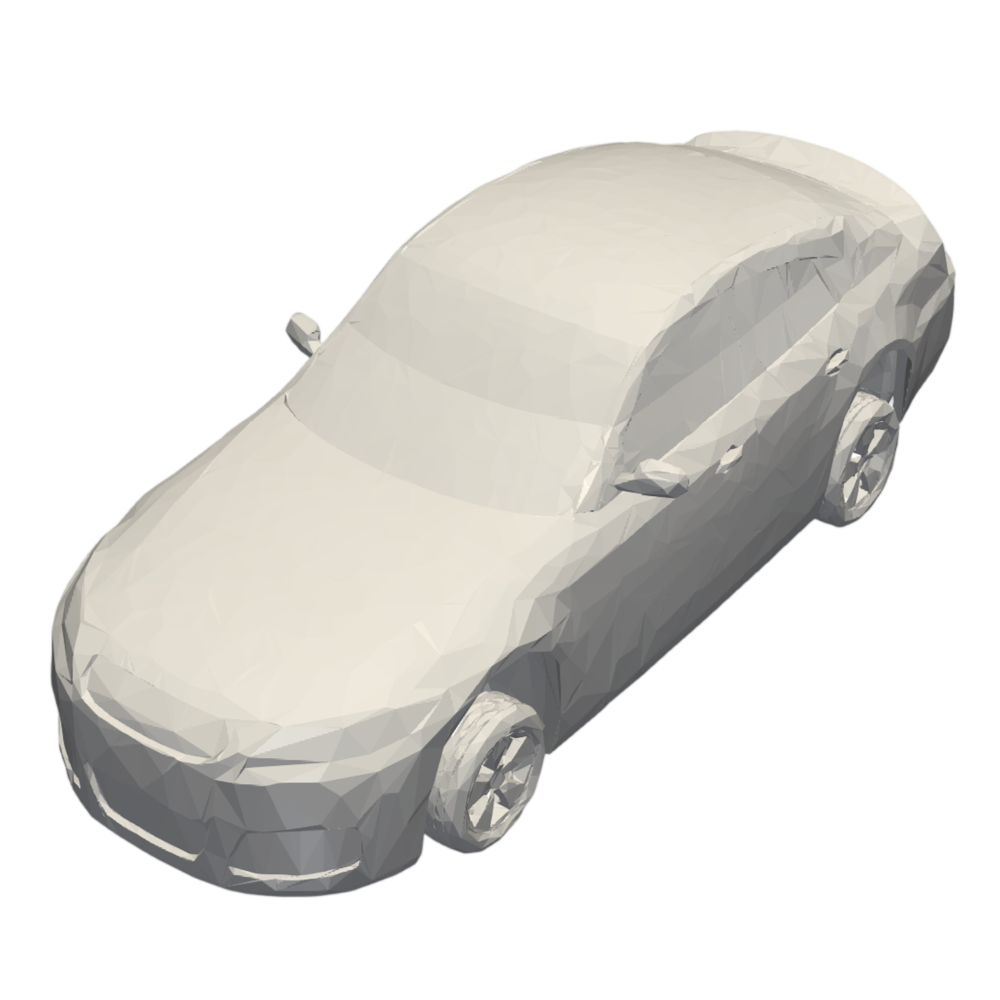
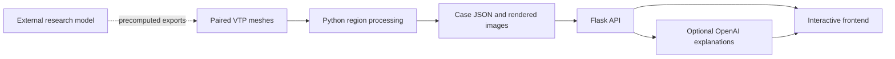

# AeroOpt

**From aerodynamic model outputs to interactive engineering insight.**

[](LICENSE)

AeroOpt is a research prototype developed for **Mercedes-Benz Tech Malaysia — MBTMY Vibathon 2026**, in the **AI Defined Vehicle** category. It brings precomputed vehicle geometry, pressure fields, drag results, and an AI assistant into one browser workflow. This repository publishes the application and result-processing layer; the research model used upstream is maintained separately.



## What you can explore

- **Seven vehicle cases:** compare before/after geometry and pressure visualizations.
- **Regional analysis:** inspect front, roof, side, and rear displacement and pressure summaries.
- **Drag dashboard:** view the recorded before/after values and relative change.
- **AI explanations:** optional image comparison, region-specific interpretation, and case-grounded questions.
- **Result pipeline:** transform paired VTP meshes into JSON summaries consumed by the application.

The public demo reads saved results. Selecting “Analyze” opens the analysis views; it does not run training, CFD, or shape optimization. Displayed improvements are case metadata, not independently reproduced performance benchmarks.

## Quick start

Requires Python 3.10 or later. No frontend build step or GPU is required.

```bash
git clone https://github.com/qinyiningpower/aeroopt.git
cd aeroopt
python -m venv .venv
source .venv/bin/activate
# Windows PowerShell: .venv\Scripts\Activate.ps1
pip install -r backend/requirements.txt
python backend/app.py
```

Open **http://127.0.0.1:5000**. Select a vehicle, compare the saved images, then open Shape, Pressure, Drag, or AI analysis. The browser and API are served from the same origin.

The case explorer works without an API key. To enable AI explanations, copy `backend/.env.example` to `backend/.env`, set `OPENAI_API_KEY`, and restart. The key stays on the server. AI requests send selected case summaries and, for image analysis, pressure images to the configured provider. The UI clearly reports when AI is disabled. External fonts, Chart.js, and MathJax require internet access.

## Architecture



The application separates scientific computation from presentation. Each request identifies its case, so one visitor's selection cannot change another visitor's data. Numerical results come from the case files; the language model provides interpretation, not new simulation results.

| Component | Implementation | Included here |
| --- | --- | --- |
| Browser experience | HTML, CSS, JavaScript, Chart.js | Yes |
| Application API and AI integration | Python, Flask, OpenAI SDK | Yes |
| Regional postprocessing | NumPy, PyVista | Yes |
| Case exports | JSON summaries and PNG renderings | Seven cases |
| Research model and training | Separate research project | No |
| Raw dataset and model checkpoints | External storage | No |

## Repository map

```text
backend/              Flask service, prompts, case loader, precomputed cases
frontend/             Vehicle selection, comparisons, analysis, and chat
pipeline/             VTP-to-region JSON processing
tests/                API and artifact consistency checks
docs/                 API contract, data provenance, model integration, interview notes
.github/workflows/     Automated verification
```

## Engineering focus and contribution

**Role: Team Leader & Backend Developer.** The project owner led the competition team and was responsible for backend development. This portfolio highlights the backend-facing result pipeline, application interfaces, and integration boundary connecting research outputs to the frontend and AI assistant.

This publication edition adds portable startup, request-scoped case selection, input validation, secret exclusion, safer text rendering, automated checks, and English documentation. These release improvements are distinguished from the original competition work in [the project notes](docs/PROJECT_NOTES.md).

## Evidence and limitations

- The repository contains seven exported cases; it does not establish accuracy, generalization, latency, or validated optimization gains.
- Source case metadata contains rounded drag values. Treat them as recorded demo values, not benchmark evidence.
- Regional masks are geometric heuristics and may overlap. They are not semantic segmentation or a decomposition of total drag.
- Pressure units and original normalization are not documented in the supplied exports. The UI reports source values without claiming physical units.
- AI explanations can be wrong. Pressure summaries alone cannot establish causal drag contributions.
- Chat is stateless. The service is a local prototype without authentication or production rate limiting.

## Documentation

- [API and data contract](docs/API.md)
- [Connecting the separate research model](docs/MODEL_INTEGRATION.md)
- [Dataset provenance and attribution](docs/DATA_PROVENANCE.md)
- [Project ownership and interview preparation](docs/PROJECT_NOTES.md)

## Verification

```bash
pip install -r requirements-dev.txt
python -m pytest -q
```

Tests cover case isolation, invalid requests, AI-disabled behavior, mocked AI responses, static routes, and case consistency. They do not call a paid API or validate the withheld research model.

## Attribution and use

This is a competition portfolio prototype, not an official Mercedes-Benz product or an endorsed engineering tool.

The **original software and documentation in this repository are licensed under the MIT License**. Third-party datasets, trademarks, and dataset-derived materials remain subject to their respective upstream terms and are not relicensed by the MIT License.

The project owner confirmed the [DrivAerNet collection on Harvard Dataverse](https://dataverse.harvard.edu/dataverse/DrivAerNet) as the dataset source. The exact release and per-case mapping remain to be documented. See [data provenance](docs/DATA_PROVENANCE.md) and [NOTICE](NOTICE).

## License

Original software and documentation: **MIT License** — see [LICENSE](LICENSE).

Third-party and dataset-derived materials: see [NOTICE](NOTICE) for attribution and applicable upstream terms.
